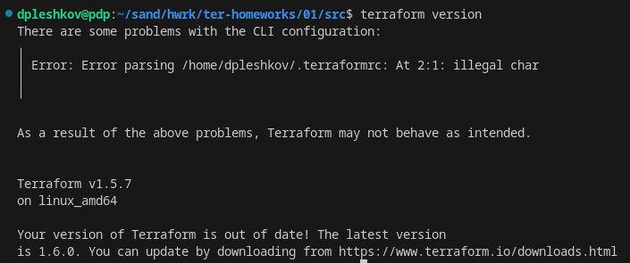
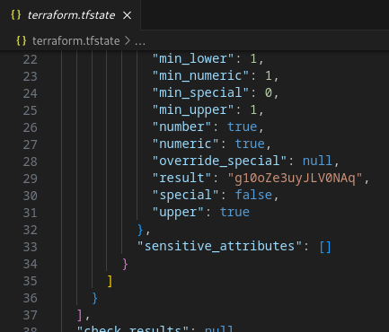
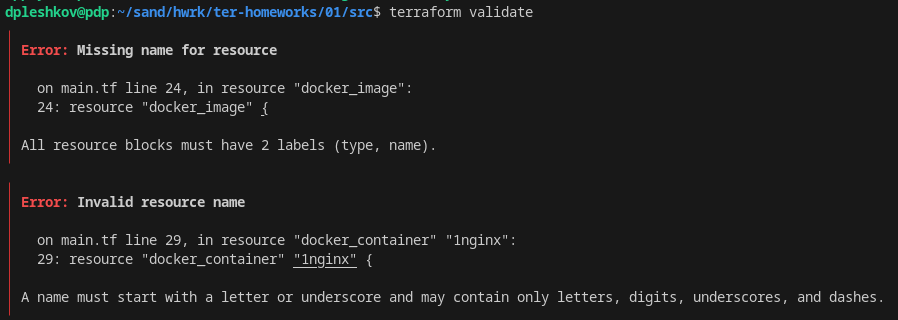
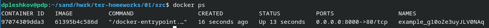
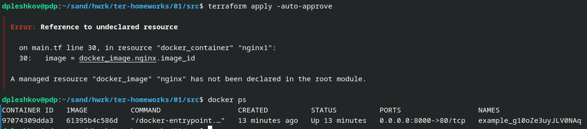
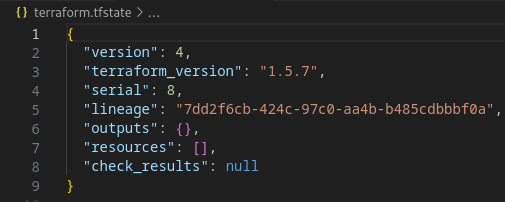
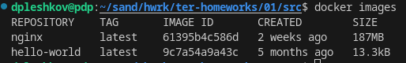
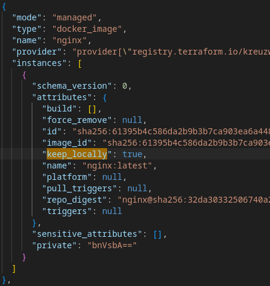
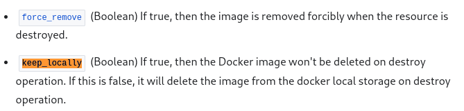

# Домашнее задание к занятию «Введение в Terraform»

### Цели задания

1. Установить и настроить Terrafrom.
2. Научиться использовать готовый код.

------

### Чек-лист готовности к домашнему заданию

1. Скачайте и установите актуальную версию **Terraform** >=1.4.X . Приложите скриншот вывода команды ```terraform --version```.


2. Скачайте на свой ПК этот git-репозиторий. Исходный код для выполнения задания расположен в директории **01/src**.
3. Убедитесь, что в вашей ОС установлен docker.
4. Зарегистрируйте аккаунт на сайте https://hub.docker.com/, выполните команду docker login и введите логин, пароль.

------

### Инструменты и дополнительные материалы, которые пригодятся для выполнения задания

1. Репозиторий с ссылкой на зеркало для установки и настройки Terraform: [ссылка](https://github.com/netology-code/devops-materials).
2. Установка docker: [ссылка](https://docs.docker.com/engine/install/ubuntu/). 
------
### Внимание!! Обязательно предоставляем на проверку получившийся код в виде ссылки на ваш github-репозиторий!
------

### Задание 1

1. Перейдите в каталог [**src**](https://github.com/netology-code/ter-homeworks/tree/main/01/src). Скачайте все необходимые зависимости, использованные в проекте. 
2. Изучите файл **.gitignore**. В каком terraform-файле, согласно этому .gitignore, допустимо сохранить личную, секретную информацию?
```
Ответ:
Личную секретную информацию допустимо сохранить в файле personal.auto.tfvars
```
3. Выполните код проекта. Найдите  в state-файле секретное содержимое созданного ресурса **random_password**, пришлите в качестве ответа конкретный ключ и его значение.
```
Ответ:
"result": "g10oZe3uyJLV0NAq"
```


4. Раскомментируйте блок кода, примерно расположенный на строчках 29–42 файла **main.tf**.
Выполните команду ```terraform validate```. Объясните, в чём заключаются намеренно допущенные ошибки. 


```
Ответ:
Ошибки:
- в строке 24 не хватает второго обязательного лэйбла ресурса
- в строке 29 имя начинается с цифры что недопустимо
```

Исправьте их.

5. Выполните код. В качестве ответа приложите: исправленный фрагмент кода и вывод команды ```docker ps```.
```
Ответ: Исправленный код:

resource "docker_image" "nginx" {
  name         = "nginx:latest"
  keep_locally = true
}

resource "docker_container" "nginx1" {
  image = docker_image.nginx.image_id
  name  = "example_${random_password.random_string.result}"

  ports {
    internal = 80
    external = 8000
  }
}
```


6. Замените имя docker-контейнера в блоке кода на ```hello_world```. Не перепутайте имя контейнера и имя образа. Мы всё ещё продолжаем использовать name = "nginx:latest". Выполните команду ```terraform apply -auto-approve```.
Объясните своими словами, в чём может быть опасность применения ключа  ```-auto-approve```. В качестве ответа дополнительно приложите вывод команды ```docker ps```.
```
Ответ:
Опасность применения ключа  -auto-approve в том что нежелательный код может быть одобрен автоматически,
без уведомления пользователя и, соответственно, без осмысленного принятия решения.
```


7. Уничтожьте созданные ресурсы с помощью **terraform**. Убедитесь, что все ресурсы удалены. Приложите содержимое файла **terraform.tfstate**.
 


8. Объясните, почему при этом не был удалён docker-образ **nginx:latest**. Ответ **обязательно** подкрепите строчкой из документации [**terraform провайдера docker**](https://docs.comcloud.xyz/providers/kreuzwerker/docker/latest/docs).  (ищите в классификаторе resource docker_image )
```
Ответ:
docker-образ не был удалён (см. результат команды docker images ниже) так как в ресурсе docker_image.nginx
аттрибут keep_locally имеет значение true, а аттрибут force_remove - значение null.
Деол в том что документация terraform провайдера docker говорит что если аттрибут keep_locally
имеет значение true, то Docker image не будет удаляться при операции destroy.
Принудительного удаления по аттрибуту force_remove также не произошло так как этот аттрибут
не установлен в значение true.
```





------

## Дополнительное задание (со звёздочкой*)

**Настоятельно рекомендуем выполнять все задания со звёздочкой.** Они помогут глубже разобраться в материале.   
Задания со звёздочкой дополнительные, не обязательные к выполнению и никак не повлияют на получение вами зачёта по этому домашнему заданию. 

### Задание 2*

1. Изучите в документации provider [**Virtualbox**](https://docs.comcloud.xyz/providers/shekeriev/virtualbox/latest/docs) от 
shekeriev.
2. Создайте с его помощью любую виртуальную машину. Чтобы не использовать VPN, советуем выбрать любой образ с расположением в GitHub из [**списка**](https://www.vagrantbox.es/).

В качестве ответа приложите plan для создаваемого ресурса и скриншот созданного в VB ресурса. 

------

### Правила приёма работы

Домашняя работа оформляется в отдельном GitHub-репозитории в файле README.md.   
Выполненное домашнее задание пришлите ссылкой на .md-файл в вашем репозитории.

### Критерии оценки

Зачёт ставится, если:

* выполнены все задания,
* ответы даны в развёрнутой форме,
* приложены соответствующие скриншоты и файлы проекта,
* в выполненных заданиях нет противоречий и нарушения логики.

На доработку работу отправят, если:

* задание выполнено частично или не выполнено вообще,
* в логике выполнения заданий есть противоречия и существенные недостатки. 

