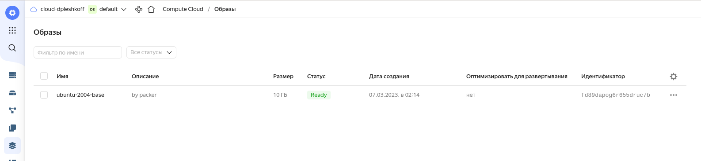
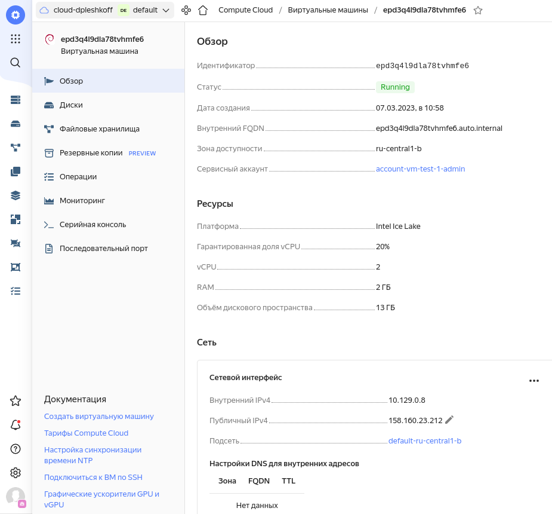
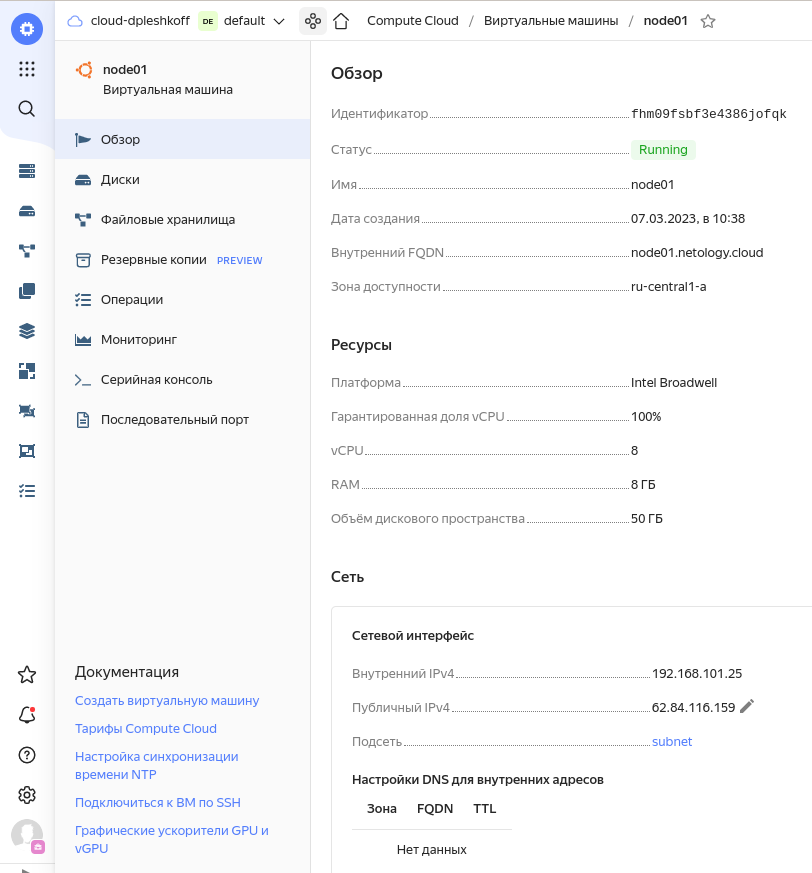

# Домашнее задание к занятию "4. Оркестрация группой Docker контейнеров на примере Docker Compose"


## Важно!

Перед отправкой работы на проверку удаляйте неиспользуемые ресурсы.
Это важно для того, чтоб предупредить неконтролируемый расход средств, полученных в результате использования промокода.

Подробные рекомендации [здесь](https://github.com/netology-code/virt-homeworks/blob/virt-11/r/README.md)

---

## Задача 1

Создать собственный образ  любой операционной системы (например, ubuntu-20.04) с помощью Packer ([инструкция](https://cloud.yandex.ru/docs/tutorials/infrastructure-management/packer-quickstart))

Для получения зачета вам необходимо предоставить скриншот страницы с созданным образом из личного кабинета YandexCloud.
```Ответ:```
<p align="center">
  
</p>


## Задача 2

**2.1** Создать вашу первую виртуальную машину в YandexCloud с помощью web-интерфейса YandexCloud.        



**2.2*** **(Необязательное задание)**      
Создать вашу первую виртуальную машину в YandexCloud с помощью terraform (вместо использования веб-интерфейса YandexCloud).
Используйте terraform код в директории ([src/terraform](https://github.com/netology-group/virt-homeworks/tree/virt-11/05-virt-04-docker-compose/src/terraform))



```
dpleshkov@debian:~/github/hwrk/virt-homeworks/05-virt-04-docker-compose/src/terraform$ terraform apply

Terraform used the selected providers to generate the following execution plan. Resource actions are indicated with the following symbols:
  + create

Terraform will perform the following actions:

  # yandex_compute_instance.node01 will be created
  + resource "yandex_compute_instance" "node01" {
      + allow_stopping_for_update = true
      + created_at                = (known after apply)
      + folder_id                 = (known after apply)
      + fqdn                      = (known after apply)
      + hostname                  = "node01.netology.cloud"
      + id                        = (known after apply)
      + metadata                  = {
          + "ssh-keys" = <<-EOT
                ubuntu:ssh-rsa AAAAB3NzaC1yc2EAAAADAQABAAABAQDSJwVvVnyF4h+EbOrIOtl00Y5NSxHgRBttOAvEA/TJwB/OGjx0Pl7auQGtDCCndp93TaXbkCQAbTSuWNxGV4haQweOs/8xbzaw6Xp562ph58Lxo9tZJqhQ1lsfa1x+kVgzl7W1G6hbg5bjsy/c3Pnvqv4lFdfWpKILS8DWrMR7SjxIdBbc7tiggTs3Best+7C2qy0g5Bg5NCMr3fXo5Oo5hdb6k55yigdLABR75G9IOA3NpqE+uNi7zrgjephijcTqfFGCOUYHtZDNuxdZwETbB6EZzSrOAW6eIdvPagG7bsWnXpjeZ9mCsUThG31cRJEeJjyE4FUuXKeykJyIrKt1 dpleshkov@debian
            EOT
        }
      + name                      = "node01"
      + network_acceleration_type = "standard"
      + platform_id               = "standard-v1"
      + service_account_id        = (known after apply)
      + status                    = (known after apply)
      + zone                      = "ru-central1-a"

      + boot_disk {
          + auto_delete = true
          + device_name = (known after apply)
          + disk_id     = (known after apply)
          + mode        = (known after apply)

          + initialize_params {
              + block_size  = (known after apply)
              + description = (known after apply)
              + image_id    = "fd89dapog6r655druc7b"
              + name        = "root-node01"
              + size        = 50
              + snapshot_id = (known after apply)
              + type        = "network-nvme"
            }
        }

      + metadata_options {
          + aws_v1_http_endpoint = (known after apply)
          + aws_v1_http_token    = (known after apply)
          + gce_http_endpoint    = (known after apply)
          + gce_http_token       = (known after apply)
        }

      + network_interface {
          + index              = (known after apply)
          + ip_address         = (known after apply)
          + ipv4               = true
          + ipv6               = (known after apply)
          + ipv6_address       = (known after apply)
          + mac_address        = (known after apply)
          + nat                = true
          + nat_ip_address     = (known after apply)
          + nat_ip_version     = (known after apply)
          + security_group_ids = (known after apply)
          + subnet_id          = (known after apply)
        }

      + placement_policy {
          + host_affinity_rules = (known after apply)
          + placement_group_id  = (known after apply)
        }

      + resources {
          + core_fraction = 100
          + cores         = 8
          + memory        = 8
        }

      + scheduling_policy {
          + preemptible = (known after apply)
        }
    }

  # yandex_vpc_network.default will be created
  + resource "yandex_vpc_network" "default" {
      + created_at                = (known after apply)
      + default_security_group_id = (known after apply)
      + folder_id                 = (known after apply)
      + id                        = (known after apply)
      + labels                    = (known after apply)
      + name                      = "net"
      + subnet_ids                = (known after apply)
    }

  # yandex_vpc_subnet.default will be created
  + resource "yandex_vpc_subnet" "default" {
      + created_at     = (known after apply)
      + folder_id      = (known after apply)
      + id             = (known after apply)
      + labels         = (known after apply)
      + name           = "subnet"
      + network_id     = (known after apply)
      + v4_cidr_blocks = [
          + "192.168.101.0/24",
        ]
      + v6_cidr_blocks = (known after apply)
      + zone           = "ru-central1-a"
    }

Plan: 3 to add, 0 to change, 0 to destroy.

Changes to Outputs:
  + external_ip_address_node01_yandex_cloud = (known after apply)
  + internal_ip_address_node01_yandex_cloud = (known after apply)

Do you want to perform these actions?
  Terraform will perform the actions described above.
  Only 'yes' will be accepted to approve.

  Enter a value: yes

yandex_vpc_network.default: Creating...
yandex_vpc_network.default: Creation complete after 2s [id=enprlf4ioh2lq8c073l8]
yandex_vpc_subnet.default: Creating...
yandex_vpc_subnet.default: Creation complete after 1s [id=e9bicjph1lm5b1q9qqs4]
yandex_compute_instance.node01: Creating...
yandex_compute_instance.node01: Still creating... [10s elapsed]
yandex_compute_instance.node01: Still creating... [20s elapsed]
yandex_compute_instance.node01: Still creating... [30s elapsed]
yandex_compute_instance.node01: Still creating... [40s elapsed]
yandex_compute_instance.node01: Still creating... [50s elapsed]
yandex_compute_instance.node01: Creation complete after 54s [id=fhm09fsbf3e4386jofqk]

Apply complete! Resources: 3 added, 0 changed, 0 destroyed.

Outputs:

external_ip_address_node01_yandex_cloud = "62.84.116.159"
internal_ip_address_node01_yandex_cloud = "192.168.101.25"
```


## Задача 3

С помощью ansible и docker-compose разверните на виртуальной машине из предыдущего задания систему мониторинга на основе Prometheus/Grafana .
Используйте ansible код в директории ([src/ansible](https://github.com/netology-group/virt-homeworks/tree/virt-11/05-virt-04-docker-compose/src/ansible))

Для получения зачета вам необходимо предоставить вывод команды "docker ps" , все контейнеры, описанные в ([docker-compose](https://github.com/netology-group/virt-homeworks/blob/virt-11/05-virt-04-docker-compose/src/ansible/stack/docker-compose.yaml)),  должны быть в статусе "Up".

## Задача 4

1. Откройте веб-браузер, зайдите на страницу http://<внешний_ip_адрес_вашей_ВМ>:3000.
2. Используйте для авторизации логин и пароль из ([.env-file](https://github.com/netology-group/virt-homeworks/blob/virt-11/05-virt-04-docker-compose/src/ansible/stack/.env)).
3. Изучите доступный интерфейс, найдите в интерфейсе автоматически созданные docker-compose панели с графиками([dashboards](https://grafana.com/docs/grafana/latest/dashboards/use-dashboards/)).
4. Подождите 5-10 минут, чтобы система мониторинга успела накопить данные.

Для получения зачета, вам необходимо предоставить: 
- Скриншот работающего веб-интерфейса Grafana с текущими метриками, как на примере ниже
<p align="center">
  
</p>

## Задача 5 (*)

Создать вторую ВМ и подключить её к мониторингу развёрнутому на первом сервере.

Для получения зачета, вам необходимо предоставить:
- Скриншот из Grafana, на котором будут отображаться метрики добавленного вами сервера.

