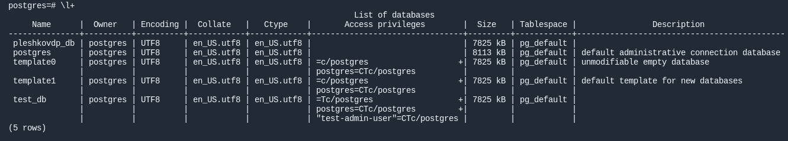
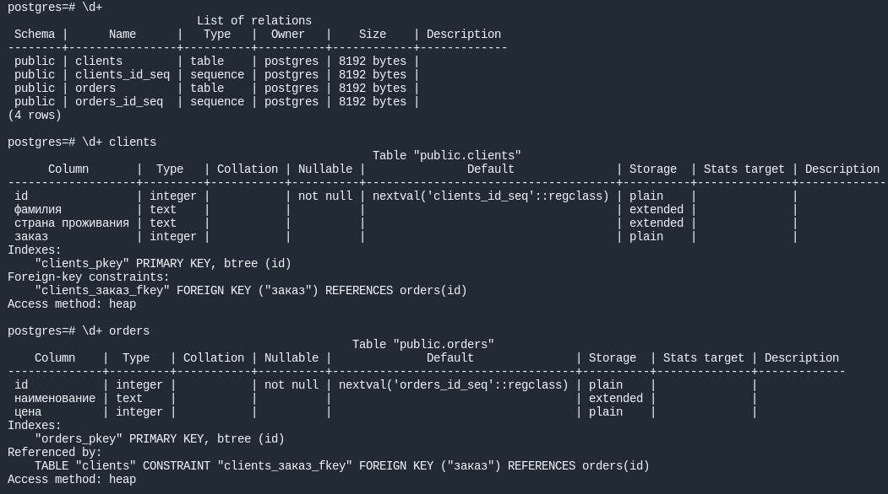
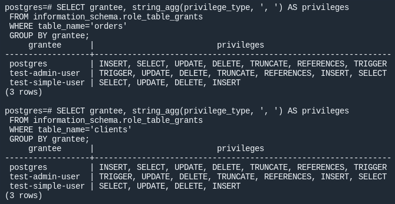

# Домашнее задание к занятию "2. SQL"

## Введение

Перед выполнением задания вы можете ознакомиться с 
[дополнительными материалами](https://github.com/netology-code/virt-homeworks/blob/virt-11/additional/README.md).

## Задача 1

Используя docker поднимите инстанс PostgreSQL (версию 12) c 2 volume, 
в который будут складываться данные БД и бэкапы.

Приведите получившуюся команду или docker-compose манифест.
```
dpleshkov@debian:~/github/hwrk/virt-homeworks/06-db-02-sql/src$ cat docker-compose.yml 
version: "3"
services:
  netology-db:
    image: postgres:12 # Образ, который мы будем использовать
    container_name: pleshkovdp-postgres-db # Имя, которым будет называться наш контейнер
    ports: # Порты, которые мы пробрасываем с нашего докер сервера внутрь контейнера
      - 5432:5432
    volumes: # Папки, которые мы пробросим с докер сервера внутрь контейнера
      - ./pg_data:/var/lib/postgresql/data/pgdata
      - ./pg_backup:/var/lib/postgresql/backups
    environment: # Переменные среды
      POSTGRES_PASSWORD: pleshkovdp12!3!! # Задаём пароль от пользователя postgres
      POSTGRES_DB: pleshkovdp_db # БД которая сразу же будет создана
      PGDATA: /var/lib/postgresql/data/pgdata # Путь внутри контейнера, где будет папка pgdata
    networks:
      pleshkovdp-my-netology-hw:
        ipv4_address: 172.22.0.2
    restart: always # Режим перезапуска контейнера. Контейнер всегда будет перезапускаться

networks:
  pleshkovdp-my-netology-hw:
    driver: bridge
    ipam:
      config:
      - subnet: 172.22.0.0/24
```


## Задача 2

В БД из задачи 1: 
- создайте пользователя test-admin-user и БД test_db
- в БД test_db создайте таблицу orders и clients (спeцификация таблиц ниже)
- предоставьте привилегии на все операции пользователю test-admin-user на таблицы БД test_db
- создайте пользователя test-simple-user  
- предоставьте пользователю test-simple-user права на SELECT/INSERT/UPDATE/DELETE данных таблиц БД test_db

Таблица orders:
- id (serial primary key)
- наименование (string)
- цена (integer)

Таблица clients:
- id (serial primary key)
- фамилия (string)
- страна проживания (string, index)
- заказ (foreign key orders)

Приведите:
- итоговый список БД после выполнения пунктов выше,
- описание таблиц (describe)
- SQL-запрос для выдачи списка пользователей с правами над таблицами test_db
- список пользователей с правами над таблицами test_db

```
Использованные команды:
sudo docker exec -it b33b3d13ee5c /bin/bash
psql -U postgres
CREATE USER "test-admin-user" WITH PASSWORD '1';
CREATE DATABASE test_db;
CREATE USER "test-simple-user" WITH PASSWORD '1';
CREATE TABLE IF NOT EXISTS orders (
 id serial PRIMARY KEY,
 наименование text,
 цена integer
 );
CREATE TABLE IF NOT EXISTS clients (
 id serial PRIMARY KEY,
 фамилия text,
 "страна проживания" text, 
 заказ integer,
 FOREIGN KEY (заказ) REFERENCES orders (id)
);
GRANT ALL ON DATABASE test_db TO "test-admin-user";
GRANT SELECT, INSERT, UPDATE, DELETE ON TABLE orders, clients TO "test-simple-user";
GRANT ALL ON TABLE orders, clients TO "test-admin-user";
\l+
\d+
\d+ clients
\d+ orders
SELECT grantee, string_agg(privilege_type, ', ') AS privileges
 FROM information_schema.role_table_grants 
 WHERE table_name='orders'   
 GROUP BY grantee;
SELECT grantee, string_agg(privilege_type, ', ') AS privileges
 FROM information_schema.role_table_grants 
 WHERE table_name='clients'   
 GROUP BY grantee;
```
**Ответ:**




## Задача 3

Используя SQL синтаксис - наполните таблицы следующими тестовыми данными:

Таблица orders

|Наименование|цена|
|------------|----|
|Шоколад| 10 |
|Принтер| 3000 |
|Книга| 500 |
|Монитор| 7000|
|Гитара| 4000|

Таблица clients

|ФИО|Страна проживания|
|------------|----|
|Иванов Иван Иванович| USA |
|Петров Петр Петрович| Canada |
|Иоганн Себастьян Бах| Japan |
|Ронни Джеймс Дио| Russia|
|Ritchie Blackmore| Russia|

Используя SQL синтаксис:
- вычислите количество записей для каждой таблицы 
- приведите в ответе:
    - запросы 
    - результаты их выполнения.

## Задача 4

Часть пользователей из таблицы clients решили оформить заказы из таблицы orders.

Используя foreign keys свяжите записи из таблиц, согласно таблице:

|ФИО|Заказ|
|------------|----|
|Иванов Иван Иванович| Книга |
|Петров Петр Петрович| Монитор |
|Иоганн Себастьян Бах| Гитара |

Приведите SQL-запросы для выполнения данных операций.

Приведите SQL-запрос для выдачи всех пользователей, которые совершили заказ, а также вывод данного запроса.
 
Подсказк - используйте директиву `UPDATE`.

## Задача 5

Получите полную информацию по выполнению запроса выдачи всех пользователей из задачи 4 
(используя директиву EXPLAIN).

Приведите получившийся результат и объясните что значат полученные значения.

## Задача 6

Создайте бэкап БД test_db и поместите его в volume, предназначенный для бэкапов (см. Задачу 1).

Остановите контейнер с PostgreSQL (но не удаляйте volumes).

Поднимите новый пустой контейнер с PostgreSQL.

Восстановите БД test_db в новом контейнере.

Приведите список операций, который вы применяли для бэкапа данных и восстановления. 

---

### Как cдавать задание

Выполненное домашнее задание пришлите ссылкой на .md-файл в вашем репозитории.

---
