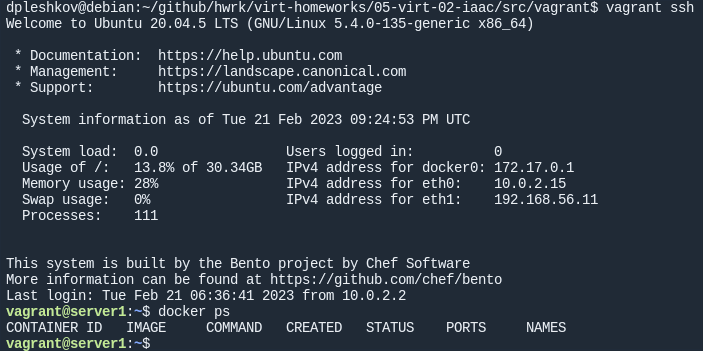

# Домашнее задание к занятию "2. Применение принципов IaaC в работе с виртуальными машинами"

## Задача 1

- Опишите своими словами основные преимущества применения на практике IaaC паттернов.
```
Преимущества состоят в экономии сил и времени, упрощении управления и снижении риска внесения ошибок 
в процессе настройки и поддержки инфраструктуры, повышение стабильности инфраструктуры. 
За счет этого, в часности, достигается повышение эффективности разработки программных продуктов 
и существенное снижение важного бизнес-параметра - "time to market".
```
- Какой из принципов IaaC является основополагающим?
```
Основополагающим принципом является управление инфраструктурой посредством скриптов, 
управляемых как обычный программный код. Использование скриптов позволяет обеспечить идемпотентность инфаструктурных объектов и связей между ними, то есть позволяет обеспечить установку заранее определенного состояния инфаструктурных объектов и связей между ними.
```

## Задача 2

- Чем Ansible выгодно отличается от других систем управление конфигурациями?
```
Преимущества:
- не требуется использовать программные агенты на управляемых узлах;
- простой и хорошо документированный скриптовой язык, использующий деклоративный подход;
```

- Какой, на ваш взгляд, метод работы систем конфигурации более надёжный push или pull?
```
Надежность, полагаю, сопоставимая.
push, полагаю, обеспечивает меньшую сетевую нагрузку при меньшей задержке начала выполнения новой задачи
Зато есть ситуации когда подойдет только pull - в случае когда входящие соединения запрещены 
из соображений безопасности или при связи через интернет в отсутствии белого IP у управляемого узла. 
```


## Задача 3

Установить на личный компьютер:

- [VirtualBox](https://www.virtualbox.org/)
- [Vagrant](https://github.com/netology-code/devops-materials)
- [Terraform](https://github.com/netology-code/devops-materials/blob/master/README.md)
- Ansible


## Задача 4 

Воспроизвести практическую часть лекции самостоятельно.

- Создать виртуальную машину.
- Зайти внутрь ВМ, убедиться, что Docker установлен с помощью команды
```
docker ps
```


Vagrantfile из лекции  и код ansible находятся в [папке](https://github.com/netology-code/virt-homeworks/tree/virt-11/05-virt-02-iaac/src).

Примечание! Если Vagrant выдает вам ошибку:
```
URL: ["https://vagrantcloud.com/bento/ubuntu-20.04"]     
Error: The requested URL returned error: 404:
```

Выполните следующие действия:
1. Скачайте с [сайта](https://app.vagrantup.com/bento/boxes/ubuntu-20.04) файл-образ "bento/ubuntu-20.04"
2. Добавьте его в список образов Vagrant: "vagrant box add bento/ubuntu-20.04 <путь к файлу>"
